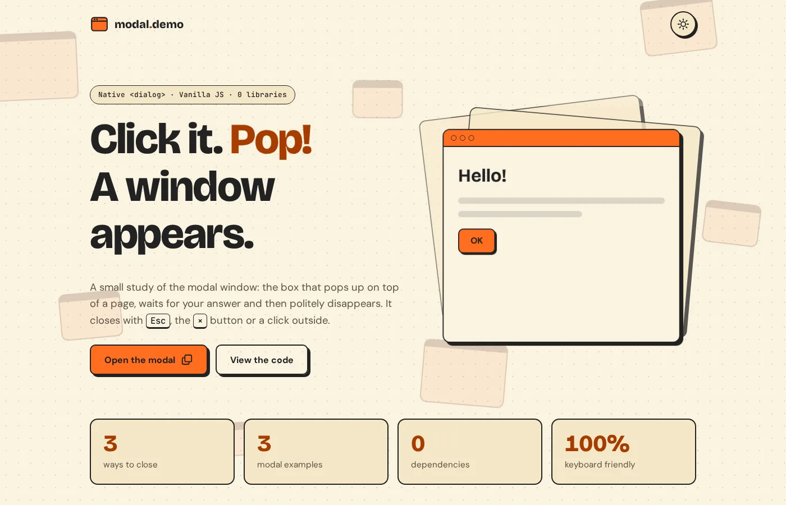

# Modal Window Demo

An accessible, animated modal window built with the native HTML `<dialog>` element, plain CSS and vanilla JavaScript.

**[Live demo](https://brutall100.github.io/modal-window-demo/)** · **[Source code](https://github.com/brutall100/modal-window-demo)**



## About

A modal is the little window that pops up on top of a page, waits for your answer and then goes away. This project started as a tiny first try at building one. Now it is a small playground that shows three kinds of modals and how to make them feel good: smooth, easy to close and friendly to keyboard and screen reader users.

## Features

- **Three modal examples:** a simple message, a confirm dialog and a form with validation.
- **Three ways to close:** the `×` button, the `Esc` key or a click on the dark backdrop.
- **Accessible:** built on `<dialog>` and `showModal()`, so focus stays inside the modal and goes back to the button that opened it. It also has a "Skip to content" link, visible focus rings and labelled form fields.
- **Light and dark theme:** follows your system setting, has a toggle that remembers your choice and never flashes the wrong theme while the page loads.
- **Pop animations:** modals grow in and shrink out, buttons lift and press down with a ripple, cards rise on hover, numbers count up and sections fade in on scroll.
- **Live background:** window-shaped cards float slowly behind the page.
- **Smooth:** everything moves with `transform` and `opacity` only. `prefers-reduced-motion` turns the motion off.
- **Responsive:** works on a 390px phone without sideways scrolling.

## Built with

- HTML5 (`<dialog>`), CSS (custom properties, grid, keyframes) and vanilla JavaScript
- No frameworks, no build step, no dependencies

**Color palette** (all colors live in `:root` at the top of `css/style.css`):

| Role | Light | Dark |
| --- | --- | --- |
| Background | `#FAF3E1` cream | `#1C1916` warm night |
| Surface | `#F5E7C6` sand | `#2A251F` raised night |
| Text | `#222222` ink | `#FAF3E1` cream |
| Accent (buttons, glow) | `#FF6D1F` orange | `#FF6D1F` orange |
| Accent text (links) | `#A63C00` deep orange | `#FF6D1F` orange |

All text passes WCAG AA contrast. The bright orange is too light for text on cream (2.5:1), so the text uses the deeper `#A63C00` (5.8:1).

**Fonts** from Google Fonts: [Bricolage Grotesque](https://fonts.google.com/specimen/Bricolage+Grotesque) for headings, [DM Sans](https://fonts.google.com/specimen/DM+Sans) for text, and [JetBrains Mono](https://fonts.google.com/specimen/JetBrains+Mono) for code and keys.

## What I learned

- The native `<dialog>` element does most of the hard work: it traps focus, closes on `Esc` and puts the modal on the top layer.
- A click where `event.target` is the dialog itself is a click on the backdrop, so the modal can close on outside clicks.
- To animate a modal **out**, stop the instant close, play a CSS animation, then call `close()` when it ends.
- Asset paths should be relative (`css/style.css`, not `/css/style.css`), or they break on GitHub Pages.
- A tiny script in `<head>` can set the saved theme before the first paint, so the page does not flash.
- Keeping every color in CSS custom properties makes a full re-theme take one minute.

## Run it locally

No install needed. Clone the repo and open `index.html` in a browser:

```bash
git clone https://github.com/brutall100/modal-window-demo.git
cd modal-window-demo
```

Or serve it with any static server, for example:

```bash
npx http-server .
```

## Project structure

```
modal-window-demo/
├── index.html          # page markup and the three <dialog> modals
├── css/
│   └── style.css       # palette, layout, animations, themes
├── js/
│   ├── theme-init.js   # sets the saved theme before the page paints
│   └── main.js         # modals, theme toggle, ripple, count-up, reveal
├── images/
│   └── favicon.svg     # window icon in the project colors
├── docs/
│   └── screenshot.webp # README screenshot
├── LICENSE
└── README.md
```

## Credits

- Made by [brutall100](https://github.com/brutall100).
- Fonts by Google Fonts.
- Released under the [MIT License](LICENSE).
